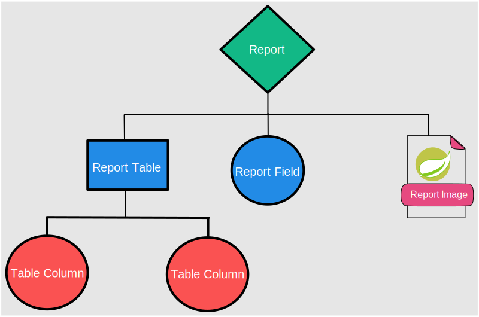

# Reporting [Spring Boot + Jasperreports]
  
A Demo project for generating PDF reports in Spring Boot using Jasper Reports.  

  <table>
    <tr>
      <td></td>
      <td></td>
      <td></td>
    </tr>
  </table>

  

## Main Technologies  
- Java
- Jasperreports
- TIBCO Jaspersoft Studio (Community Edition)  

## Features
- Tested with JMeter against 1000 requests.  
- Support for LTR & RTL languages; Given English and Arabic as an example with the same workflow except for data input.
- Notes for different workflows created as "**how to**" in order to help users [in progress].
- Supported output formats {PDF, XLS, CSV, HTML}.
## Steps to deploy
- Load this project on your preferred IDE e.g. Intellij or Netbeans ...etc and Maven will load all dependencies
  and configure directories.    
- Every Jasperreports workflow starts with the creation of a template, exported to a **.jrxml** file.
  This file will be compiled later (during runtime) to a **.jasper** file.   
- To create these templates easily, you'll need to use the Jaspersoft Studio.
- After exporting your templates from the editor, you can insert them under 
  "resources/static/templates".    
- In order to support multiple languages/locales per record, you'll have to create a template for each locale.  
- On this example, I've provided two templates {invoice_en, invoice_ar} representing the two locale implementations of a report called invoice.  
- You'll have to follow a certain structure/hierarchy for data input. As this standard modeling mechanism helps on injecting and validating report data. See the following figure:

    
## Testing
- Provided with a testing template, You can use Postman for testing.  
- Import the [collections file]("samples/test.postman_collection.json") and enjoy.

## Preview

  <table>
    <tr>
      <td></td>
      <td></td>
    </tr>
  </table>

 

## Authors

 
 
